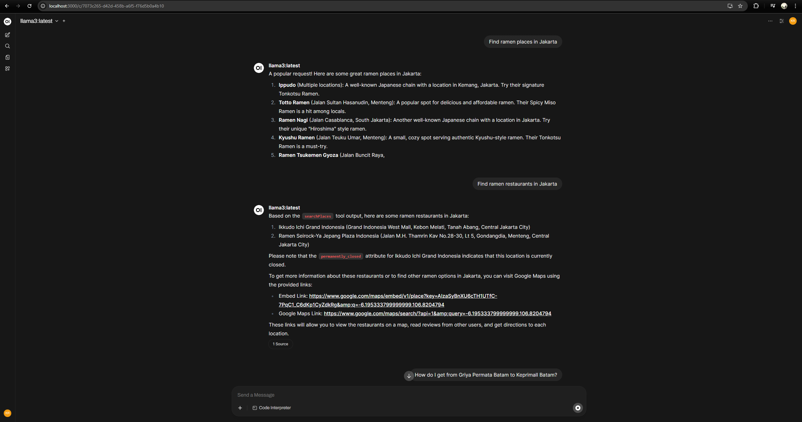
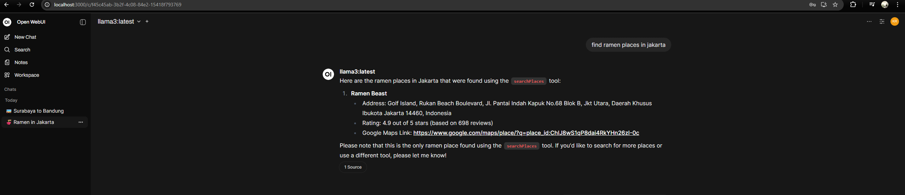
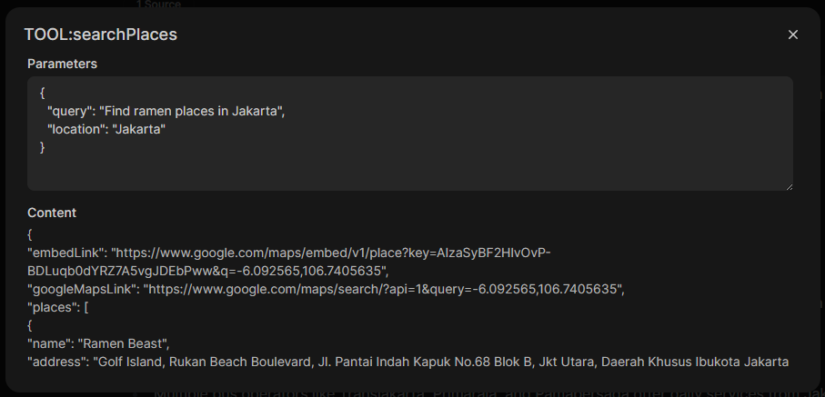
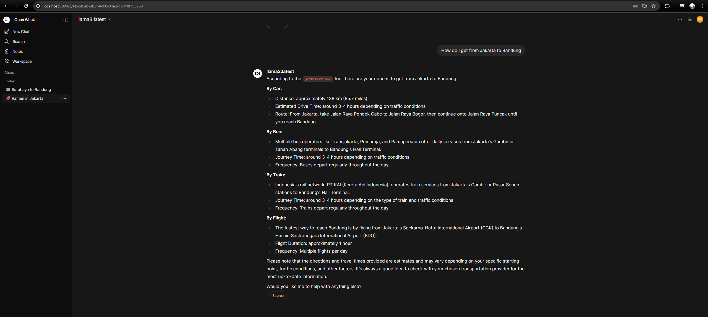

# LLM Maps Backend

A lightweight backend API that connects to **Google Maps Platform** to search for places and get directions.  
This backend is designed to be consumed by an LLM (e.g., via [Open WebUI](https://github.com/open-webui/open-webui)) so that users can ask natural language questions like:

- “Find ramen places in Jakarta.”
- “How do I get from Jakarta to Bandung?”

The response includes a **Google Maps embed link** (for inline display) and a **Google Maps link** (to open directly in the app or browser).

---

## 🚀 Features
- **Place Search** (Google Places API – Text Search)
- **Directions** (Google Directions API)
- Secure API key handling (never exposed to frontend)
- Rate limiting middleware for safe API usage
- Optional simple frontend with `<iframe>` to display maps

---

## 📦 Setup

### 1. Clone & Install
```bash
git clone <your-repo-url>
cd llm-maps-backend
npm install
```


### 2. Configure Environment
Copy .env.example → .env and add your own values:
```bash
GOOGLE_MAPS_API_KEY=your_api_key_here
PORT=5000
```

### 3. Run Backend
Copy .env.example → .env and add your own values:
```bash
npm run dev
```

Server runs at:
👉 http://localhost:5000

##  🛠️ API Endpoints
GET /api/maps/search

Search for places.

Query params:

- query (string, required)

- location (string, default: Jakarta)

- radius (meters, default: 5000)


## 🔐 Google Cloud Setup

Enable the following APIs in your Google Cloud Console:

- Maps JavaScript API
- Places API
- Directions API
- Geocoding API (optional, for resolving place names)

Ensure your API key has no application restrictions (for development).
You can add domain/IP restrictions later in production.

## 🤖 LLM Integration (with Open WebUI)

- Run Open WebUI locally.
- Configure the LLM to call your backend endpoints (/search, /directions).
- Example LLM prompt:
  - User: “Find ramen in Jakarta.”
  - LLM: Calls GET /api/maps/search?query=ramen+jakarta → returns embed + link.

## 📝 Assumptions & Design Choices

- API key is only used server-side (never exposed to client). ✅
- Backend returns both embedLink and googleMapsLink for flexibility.
- Minimal simple frontend is provided for visualization (optional).
- Rate limiting prevents abuse when exposed publicly.

## ⚡ Development Notes

- Built with Node.js, Express, Axios.
- .env required for configuration.
- nodemon included for development hot reload.


## Overview






